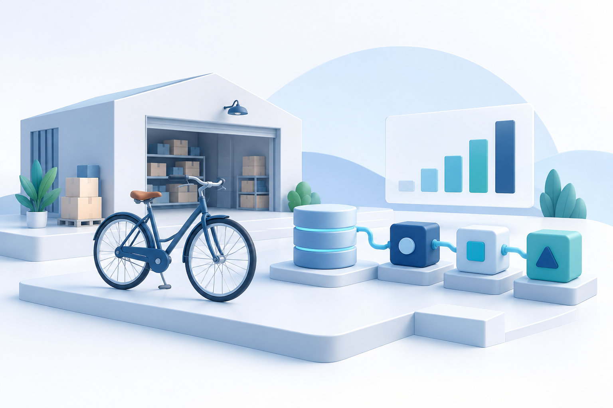

# Syllabus {.unnumbered}

Agent development combines language models with software that controls data access, execution, and presentation. This course builds a small working system in stages, from a single function tool to an analytics workflow with a Gradio interface.

{.course-cover fig-alt="Concept illustration of a bicycle business, a data store, and connected analytical components on a light background."}

## The project: a SQL analyst for Global Bike

Global Bike is the course's business scenario. A business analyst needs to compare sales, identify relevant products, and explain results without manually writing every SQL query. The target application accepts a question, proposes a query, checks it, retrieves data, and presents the SQL, a table, a suitable chart, and an explanation grounded in the returned values.

The starter includes a small **synthetic dataset** for local practice. It is not an export of the Global Bike database. Its offline demonstration uses a fixed question and query; arbitrary natural-language questions require a model. Microsoft SQL Server is the later connection target, with schema and credentials supplied separately by the instructor.

```{mermaid}
flowchart LR
  Q[Business question] --> A[Agent proposes SQL]
  A --> V[Code checks the query]
  V --> DB[(Read-only data access)]
  DB --> C[Validated chart specification]
  DB --> E[Grounded explanation]
  C --> UI[SQL, table, chart and explanation]
  E --> UI
```

## Learning outcomes

The completed project demonstrates how an agent selects tools, how a runner manages sessions and events, and how ADK 2 graph edges make execution order explicit. It also demonstrates the boundary between a model's proposed action and the code that validates and executes that action.

Evaluation includes both useful answers and observable execution: correct tool arguments, rejected queries, empty results, bounded data retrieval, isolated sessions, and a chart that represents the result faithfully. A plausible sentence alone does not establish that an analytics system works.

## Learning sequence

| Stage | Practical result |
|---|---|
| Preparation | Accounts, Windows or macOS setup, VS Code, a reproducible Python environment, and an optional SQL Server connection |
| Foundations | Single agent with a small, testable function tool |
| Runtime | A recorded turn with events and session context |
| Workflows | A graph combining deterministic functions and model reasoning |
| Interface | A Gradio application with separate browser sessions |
| Analytics | SQL, table, chart, and explanation from a controlled data path |
| Evaluation | Documented test cases, observed failures, and justified changes |

The chapters support a project kick-off, a development session, and a final presentation, matching the earlier course's progression. Dates and assessment weights are set separately for the current semester.

## Deliverables

A project submission contains the source code, locked dependencies, configuration examples without secrets, and clear start commands. A short architecture explanation documents agent responsibilities, tool contracts, query validation, session handling, and the chosen evaluation cases. The demonstration includes at least one successful question, an empty or ambiguous case, and a rejected unsafe request.

The supplied examples are a starting point. A useful extension changes a clearly defined business capability and includes evidence of its behavior, rather than adding agents solely to make the architecture larger.

## Course baseline

The implementation targets **Python 3.12 and Google ADK 2.10.0**. `uv.lock` fixes the resolved dependency versions. `GEMINI_MODEL` selects the model; the default `gemini-flash-latest` is a changing provider alias, not a reproducible model snapshot. An available explicit model ID can be configured and recorded for an assessed experiment.

The book is rendered without executing model calls. Offline examples and tests run without API credentials. Model-backed examples contact the configured Gemini service and are subject to its current availability, quotas, and pricing.
